# Lab Report 4
_David Sanchez, d4sanchez@ucsd.edu, A16854510_

 

## Step 1: (setup) Fork the repository

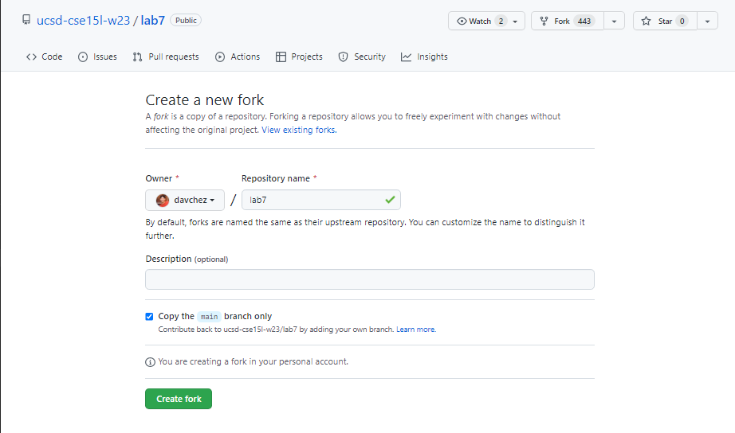

> Forked the repository from the professor's repository page for Lab 7.  Pressed the fork button in the upper right corner of the page.

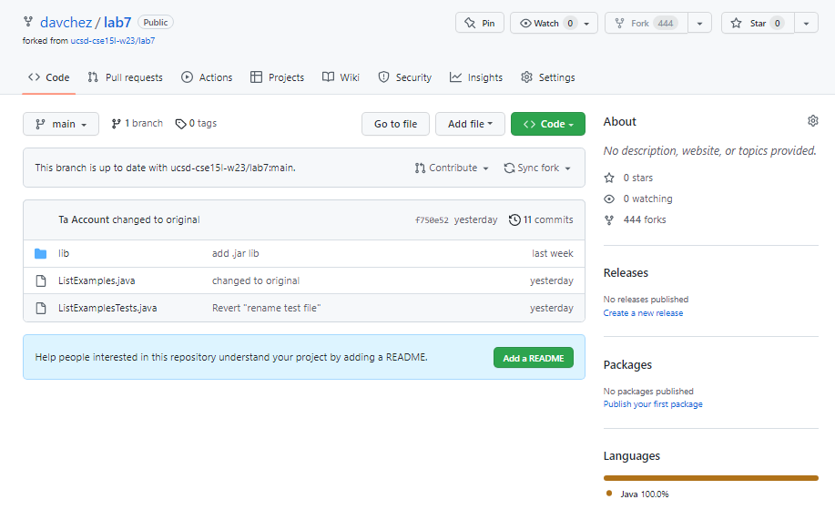

> Successfully forked his repository and was prompted to create my own repository for Lab 7.

 

## Step 2: Log into ieng6

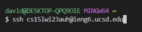

> Prior to this, created a new Bash terminal in the bottom right corner of my Visual Studio code editor.  Typed in: 
> `ssh cs15lwi23auh@ieng6.ucsd.edu`, `<enter>` 
> Following the implementation of my SSH key through my personal laptop to my server account, my password was no longer needed to log in.

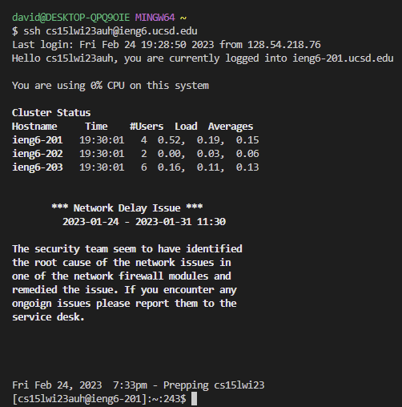

> Successfully logged into the UCSD ieng6 server.

 

## Step 3: Cloning my fork of the repository from my Github account

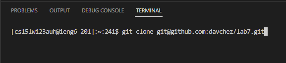

> Used `git clone git@github.com:davchez/lab7.git`, `<enter>` to clone the fork of my new Lab 7 repository and used the repository-specific SSH link (not HTTPS link) to ensure that all future adds, commits, and pushes were successful in the future.

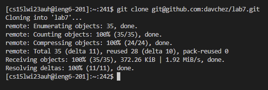

> Successfully cloned my repository into my server user directory for use.

 

## Step 4: Run the tests, demostrating that they fail

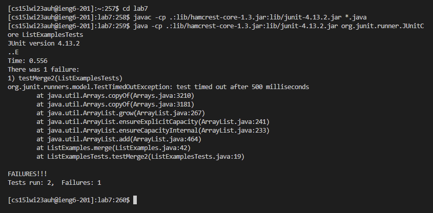

> Typed in:  
> `cd lab 7`, `<enter>`.  
> `javac -cp .:lib/hamcrest-core-1.3.jar:lib/junit-4.13.2.jar *.java`, `<enter>`  
> `java -cp .:lib/hamcrest-core-1.3.jar:lib/junit-4.13.2.jar org.junit.runner.JUnitCore ListExamplesTests`, `<enter>`  
> ListExamplesTester detected a time-out error on one of its tests, implying that there exists some form of forever loop or unbreakable code in ListExamples.

 

## Step 5: Edit the code to fix the failing test

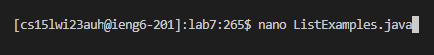

> Typed in `nano ListExamples.java`, `<enter>` to pull up the terminal editing screen for the Java file.

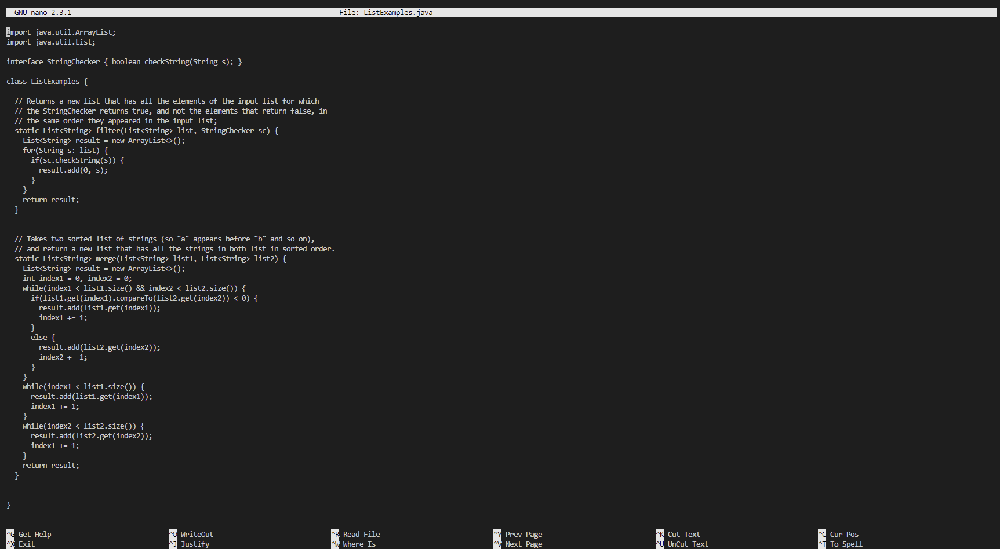

> (Actual keys pressed below.)  Accessed the nano terminal editing screen to change line 43 from "index1 += 1" to "index2 += 1", which was the cause of the time-out error on the JUnit test.

> _Keys pressed:_ `<ctrl> + <W>`, typed in `index1 += 1`, `<enter>`, pressed `<right>` 14 times, <backspace>`

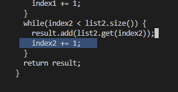

> Edit shown above.

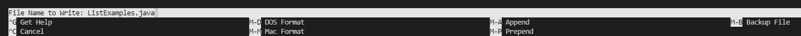

> (Actual keys pressed below).  Pressed `<ctrl> + <O>` to save my changes and to ensure that it was being saved to the right filename.

> _Keys pressed:_ `<ctrl> + <O>, <enter>`

> (Actual keys pressed below).  Pressed ctrl-X to exit the nano editing screen.

> _Keys pressed:_ `<ctrl> + <X>`

 

## Step 6: Run the tests, demonstrating that they now succeed

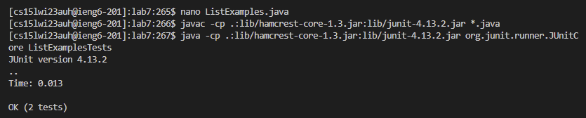

> (Actual keys pressed below).  Pressed up seven times due to incorrect inputs/pastes prior to this screenshot, then accessed the JUnit compile command.  Pressed up seven times again to access the JUnit run command on the JUnit file ListExamplesTests, which ran successfully and without any errors.

> _Keys pressed:_ `<up><up><up><up><up><up><up><enter>, <up><up><up><up><up><up><up><enter>`

 

## Step 7: Committing and pushing the resulting change to my Github account

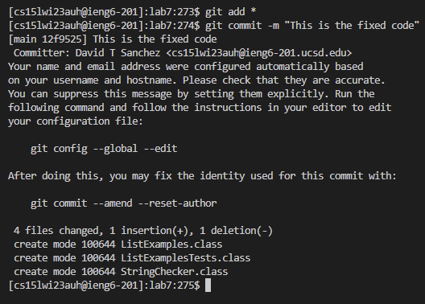

> Typed the `git add *` command to add all existing and new changes to the next commit.  Typed the `git commit -m` command with an update message after `-m`.  Indirectly, this avoids forcing the Visual Studio code editor into the VIM interface, which is ultimately not that easy to work with.  

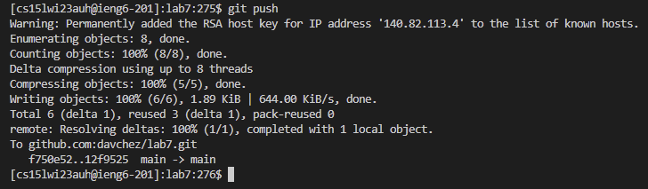

> Typed the `git push` command to push all committed changes to the GitHub repository.

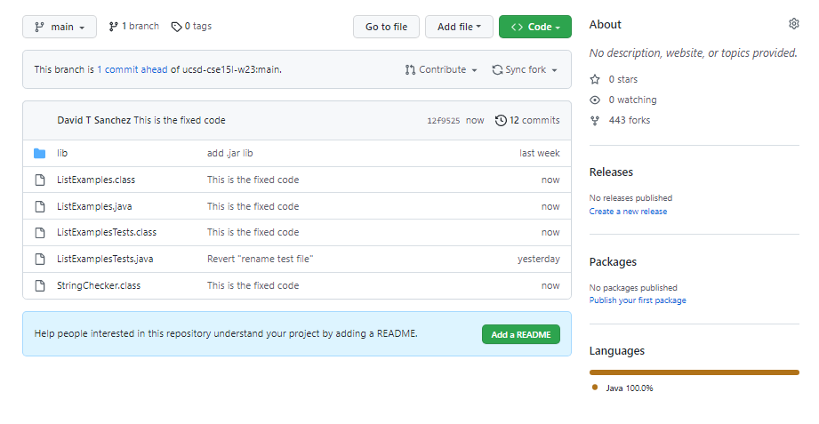

> Successfully updated necessary .java files and added new .class files from the compilation in Bash.
